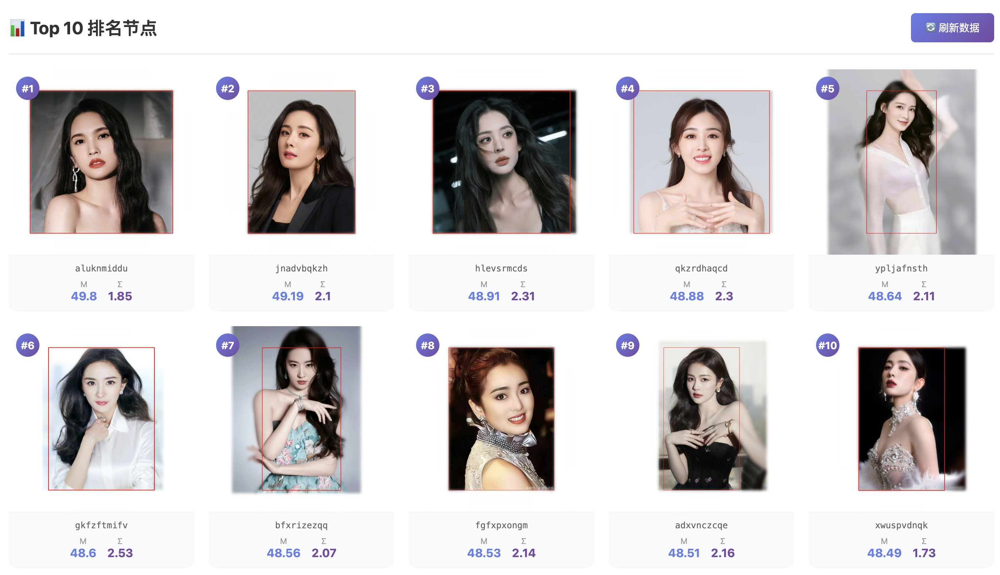
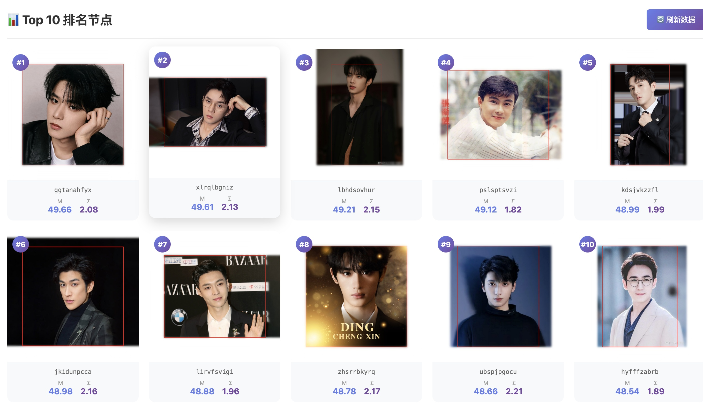
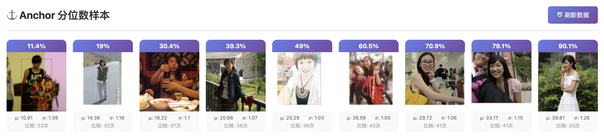
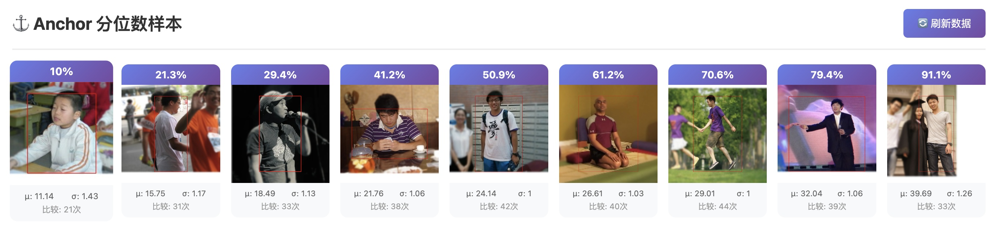

# CharmRanker

这是李鲁鲁老师一篇ACL 2026投稿的副产物

专门使用MLLM，针对颜值数据进行ranking的一套pipeline

目前正在数据准备的初期 准备最终上线一个颜值模型打分小程序和页面版

# Roadmap

- [x] 完成男、女各自的通用颜值比较数据 0.5版(考虑单一模型即可)
- [ ] 搭建颜值小模型的训练框架
- [ ] 完成页面程序后台初版
- [ ] 颜值测评微信小程序初版
- [ ] 搭建never ending 颜值比较后台（颜值竞技场）
- [ ] 完成男、女各自的通用颜值比较数据 1.0版(考虑多模型consensus)

# Current_Result

目前GLM4.6v标记出的top 10女性

目前GLM4.6v标记出的top 10男性

可以用于评分的anchors（分位数抽样）

 

可以用于评分的anchors（分位数抽样）

 

# detailed TODO

- [x] 小规模测试
- [x] 整理图片交给sirly
- [ ] 进行4000级别数据 30000次triplet的比较测试
- [ ] anchor set的标定
- [ ] 更多数据的分组

# Hiring

欢迎联系我们 如果你能够提供

- 大量的人脸、人体的数据
- 大量可以使用的gemini、GLM的api key
- 可以长期使用并且联网假设后台的GPU服务器
- 帮助参与前端与后端的开发

# Finished TODO

- [x] 原始数据准备
- [x] 人体、人脸检测
- [x] 目前存量男女各3000多，缺明星domain的。对性别、亚洲/非亚洲人的区分
- [x] 鲁叔 抓取网红 男女各500人（每人1-3张生活照/抓拍）的照片
- [x] 重构一个图片（只要body和face能检测到）normalize的函数
- [x] 编写一个 manager 可以管理节点的score 增加节点等等
- [x] 使用随机标记模拟 标注过程
- [x] 管理triplet 的message函数 使得可以用gemini 进行标注